# Microservicio de Identidades Digitales

Un microservicio completo de identidades digitales que implementa autenticación JWT, gestión de usuarios SCIM 2.0, y autorización basada en atributos (ABAC).

## Arquitectura del Sistema



El microservicio implementa los siguientes flujos principales:

- **🔐 Autenticación JWT**: Generación y validación de tokens seguros
- **🛡️ Autorización ABAC**: Evaluación de políticas basada en atributos
- **👥 Gestión SCIM**: Administración de usuarios y grupos según estándar SCIM 2.0
- **📊 Monitoreo**: Health checks 

## Características Principales

### ✅ Autenticación y Autorización
- **JWT Tokens** con soporte OAuth2/OIDC-like
- **ABAC (Attribute-Based Access Control)** con motor de políticas configurable
- **Rate limiting** por endpoint
- **Middleware de autenticación** automático

### ✅ Gestión de Identidades SCIM 2.0
- **Usuarios**: Crear, leer, actualizar, eliminar con filtros
- **Grupos**: Gestión de membresías y permisos
- **Validación completa** según especificación SCIM

### ✅ Seguridad y Observabilidad
- **Logging estructurado** con correlation IDs
- **Validación de entrada** con Pydantic
- **Health checks** para todos los servicios
- **Métricas de performance** y uso

## Estructura del Proyecto

```
prueba-sek/
├── app/                          # Aplicación principal
│   ├── core/                     # Configuración y utilidades centrales
│   │   ├── auth_middleware.py    # Middleware de autenticación JWT
│   │   ├── config.py             # Configuración de la aplicación
│   │   ├── database.py           # Configuración de base de datos SQLite
│   │   ├── jwt_manager.py        # Gestión de tokens JWT
│   │   ├── logger.py             # Logging estructurado
│   │   ├── middleware.py         # Middlewares adicionales
│   │   ├── policies.py           # Carga de políticas ABAC
│   │   ├── policy_validator.py   # Validación de políticas
│   │   └── startup.py            # Inicialización de la aplicación
│   ├── models/                   # Modelos de datos Pydantic
│   │   ├── abac.py               # Modelos para ABAC
│   │   ├── auth.py               # Modelos de autenticación
│   │   ├── database.py           # Modelos de base de datos
│   │   └── scim.py               # Modelos SCIM 2.0
│   ├── repositories/             # Capa de acceso a datos
│   │   ├── group_repository.py   # Repositorio de grupos
│   │   ├── policy_repository.py  # Repositorio de políticas
│   │   └── user_repository.py    # Repositorio de usuarios
│   ├── services/                 # Lógica de negocio
│   │   ├── abac_evaluator.py     # Motor de evaluación ABAC
│   │   ├── auth_service.py       # Servicio de autenticación
│   │   ├── authz_service.py      # Servicio de autorización
│   │   ├── scim_group_service.py # Servicio de grupos SCIM
│   │   └── scim_user_service.py  # Servicio de usuarios SCIM
│   └── views/                    # Controladores/Routers FastAPI
│       ├── auth_router.py        # Endpoints de autenticación
│       ├── authz.py              # Endpoints de autorización
│       ├── scim_groups.py        # Endpoints SCIM de grupos
│       └── scim_users.py         # Endpoints SCIM de usuarios
├── policies/                     # Políticas ABAC en JSON
│   └── policies.json             # Configuración de políticas
├── data/                         # Base de datos SQLite
├── logs/                         # Archivos de log
├── Dockerfile                    # Configuración Docker
├── docker-compose.yml            # Orquestación Docker
├── requirements.txt              # Dependencias Python
├── .env.example                  # Plantilla de configuración
└── main.py                       # Punto de entrada
```

## Configuración y Ejecución

### Prerequisitos

- Python 3.11+
- pip
- Docker (opcional)
- jq (para scripts de prueba)

### Opción 1: Entorno Virtual Python

1. **Clonar el repositorio**
   ```bash
   git clone <repository-url>
   cd prueba-sek
   ```

2. **Crear y activar entorno virtual**
   ```bash
   python -m venv venv
   source venv/bin/activate  # Linux/Mac
   # o
   venv\Scripts\activate     # Windows
   ```

3. **Instalar dependencias**
   ```bash
   pip install -r requirements.txt
   ```

4. **Configurar variables de entorno**
   ```bash
   cp .env.example .env
   # Editar .env con tus configuraciones
   ```

5. **Crear directorios necesarios**
   ```bash
   mkdir -p data logs
   ```

6. **Ejecutar la aplicación**
   ```bash
   python main.py
   ```

### Opción 2: Docker

1. **Clonar el repositorio**
   ```bash
   git clone  git@github.com:NivekTakedown/Identity-Microservice.git prueba-sek
   cd prueba-sek
   ```

2. **Configurar variables de entorno**
   ```bash
   cp .env.example .env
   # Editar .env según necesidades
   ```

3. **Ejecutar con Docker Compose**
   ```bash
   docker-compose up -d
   ```

4. **Verificar el estado**
   ```bash
   docker-compose ps
   docker-compose logs -f identity-service
   ```

### Verificación de la Instalación

```bash
# Health check
curl http://localhost:8000/health

# Documentación interactiva
open http://localhost:8000/docs
```

## Uso y Testing

### Usuarios Predefinidos

| Usuario    | Password     | Departamento | Grupos       | Rol   |
|------------|--------------|--------------|--------------|-------|
| mrios      | admin_pass   | IT           | ADMINS       | Admin |
| jdoe       | password123  | HR           | HR_READERS   | User  |
| agonzalez  | finance2024  | Finance      | FIN_APPROVERS| User  |

### Scripts de Prueba

1. **Ejecutar pruebas completas**
   ```bash
   chmod +x test_all_endpoints.sh
   ./test_all_endpoints.sh
   ```

2. **Pruebas manuales con cURL**
   ```bash
   # Obtener token JWT
   curl -X POST "http://localhost:8000/auth/token" \
     -H "Content-Type: application/json" \
     -d '{"grant_type":"password","username":"mrios","password":"admin_pass"}'
   
   # Evaluar autorización ABAC
   export JWT_TOKEN="<token-obtenido>"
   curl -X POST "http://localhost:8000/authz/evaluate" \
     -H "Content-Type: application/json" \
     -H "Authorization: Bearer $JWT_TOKEN" \
     -d '{
       "subject": {"dept": "IT", "groups": ["ADMINS"], "riskScore": 15},
       "resource": {"type": "user_data", "env": "dev"},
       "context": {"geo": "CL", "deviceTrusted": true}
     }'
   ```

### Endpoints Principales

| Método | Endpoint                    | Descripción                    | Auth |
|--------|-----------------------------|--------------------------------|------|
| POST   | `/auth/token`               | Obtener token JWT              | No   |
| GET    | `/auth/me`                  | Información del usuario actual | Sí   |
| POST   | `/scim/v2/Users`            | Crear usuario                  | No   |
| GET    | `/scim/v2/Users/{id}`       | Obtener usuario                | No   |
| POST   | `/scim/v2/Groups`           | Crear grupo                    | No   |
| POST   | `/authz/evaluate`           | Evaluar autorización ABAC      | Sí   |
| GET    | `/authz/health`             | Health check autorización      | No   |
| GET    | docs                     | Documentación interactiva      | No   |

## Políticas ABAC

Las políticas se definen en policies.json y incluyen:

- **ADMIN-OVERRIDE-01**: Administradores acceden a todo excepto producción crítica
- **HR-PAYROLL-01**: HR puede acceder a nómina desde dispositivos confiables  
- **RISK-STEPUP-01**: Usuarios de alto riesgo requieren autenticación adicional
- **FINANCE-SENSITIVE-01**: Datos financieros requieren verificación adicional
- **BUSINESS-HOURS-01**: Acceso permitido solo en horario laboral
- **DEFAULT-DENY-01**: Denegación por defecto cuando no hay políticas aplicables

### Ejemplos de Decisiones ABAC

```json
// PERMIT
{
  "decision": "Permit",
  "reasons": ["ruleId: HR-PAYROLL-01"],
  "advice": [],
  "obligations": ["Log successful access"]
}

// CHALLENGE  
{
  "decision": "Challenge",
  "reasons": ["ruleId: RISK-STEPUP-01"],
  "advice": ["Additional authentication required"],
  "obligations": ["Log challenge requirement"]
}

// DENY
{
  "decision": "Deny", 
  "reasons": ["ruleId: DEFAULT-DENY-01"],
  "advice": ["Contact administrator"],
  "obligations": ["Log denied access attempt"]
}
```

## Desarrollo

### Ejecutar Tests
```bash
pytest tests/ -v
```

### Logs
```bash
# Logs en tiempo real
tail -f logs/app.log

# Logs estructurados en JSON
cat logs/app.log | jq '.'
```

### Configuración de Desarrollo

El archivo .env permite configurar:

- **JWT_SECRET**: Clave para firmar tokens JWT
- **JWT_EXPIRE_MINUTES**: Tiempo de expiración de tokens
- **LOG_LEVEL**: Nivel de logging (DEBUG, INFO, WARNING, ERROR)
- **POLICIES_PATH**: Ruta al archivo de políticas ABAC
- **DB_PATH**: Ruta de la base de datos SQLite

## Tecnologías Utilizadas

- **FastAPI**: Framework web moderno y rápido
- **Pydantic**: Validación de datos y serialización
- **SQLite**: Base de datos ligera para desarrollo
- **JWT**: Tokens seguros para autenticación
- **structlog**: Logging estructurado
- **slowapi**: Rate limiting
- **Docker**: Containerización

## Seguridad

### Implementado
- ✅ Autenticación JWT con firmas seguras
- ✅ Validación de entrada con Pydantic
- ✅ Rate limiting por endpoint
- ✅ Middleware de autenticación
- ✅ Logging de auditoría
- ✅ CORS configurado
- ✅ Principio de mínimo privilegio con ABAC

### Recomendaciones para Producción
- Usar RS256 con gestión de claves PKI
- Implementar refresh tokens
- Configurar HTTPS/TLS
- Usar base de datos empresarial (PostgreSQL)
- Implementar gestión de secretos (Vault, K8s Secrets)
- Configurar monitoreo y alertas

## Soporte y Contribución

Este microservicio fue desarrollado como prueba técnica para demostrar competencias en:

1. **Diseño de microservicios seguros**
2. **Integración con estándares IAM (SCIM, OAuth2, JWT)**
3. **Implementación de ABAC**
4. **Principio de mínimo privilegio**
5. **Buenas prácticas de desarrollo**