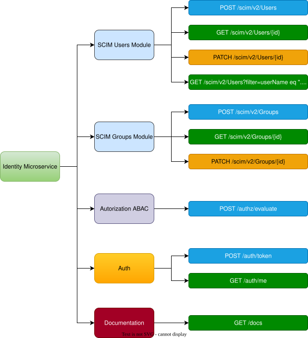

# Guía de Testing de Endpoints

## Configuración Inicial

### Variables de Entorno
```bash
export BASE_URL="http://localhost:8000"
export JWT_TOKEN=""
```

### Iniciar Servidor
```bash
python main.py
```

## 1. Authentication Endpoints

### 1.1 Generar Token JWT

**Password Grant (Usuario)**
```bash
curl -X POST "${BASE_URL}/auth/token" \
  -H "Content-Type: application/json" \
  -d '{
    "grant_type": "password",
    "username": "mrios",
    "password": "admin_pass"
  }'
```

**Client Credentials Grant (Servicio)**
```bash
curl -X POST "${BASE_URL}/auth/token" \
  -H "Content-Type: application/json" \
  -d '{
    "grant_type": "client_credentials",
    "client_id": "test_client",
    "client_secret": "test_secret",
    "scope": "read write"
  }'
```

**Guardar Token**
```bash
export JWT_TOKEN=$(curl -s -X POST "${BASE_URL}/auth/token" \
  -H "Content-Type: application/json" \
  -d '{"grant_type":"password","username":"mrios","password":"admin_pass"}' \
  | jq -r '.access_token')
```

### 1.2 Validar Token y Obtener Usuario Actual

```bash
curl -X GET "${BASE_URL}/auth/me" \
  -H "Authorization: Bearer ${JWT_TOKEN}"
```

### 1.3 Health Check de Autenticación

```bash
curl -X GET "${BASE_URL}/auth/health"
```

## 2. SCIM Users Endpoints

### 2.1 Crear Usuario

```bash
curl -X POST "${BASE_URL}/scim/v2/Users" \
  -H "Content-Type: application/json" \
  -d '{
    "userName": "testuser",
    "name": {
      "givenName": "Test",
      "familyName": "User",
      "formatted": "Test User"
    },
    "active": true,
    "emails": [
      {
        "value": "test.user@company.com",
        "primary": true,
        "type": "work"
      }
    ],
    "groups": ["HR_READERS"],
    "dept": "HR",
    "riskScore": 25
  }'
```

### 2.2 Obtener Usuario por ID

```bash
curl -X GET "${BASE_URL}/scim/v2/Users/usr_jdoe"
```

### 2.3 Listar Todos los Usuarios

```bash
curl -X GET "${BASE_URL}/scim/v2/Users"
```

### 2.4 Buscar Usuario por userName

```bash
curl -X GET "${BASE_URL}/scim/v2/Users?filter=userName%20eq%20%22jdoe%22"
```

### 2.5 Actualizar Usuario (PATCH)

```bash
curl -X PATCH "${BASE_URL}/scim/v2/Users/usr_jdoe" \
  -H "Content-Type: application/json" \
  -d '{
    "active": false,
    "dept": "IT",
    "riskScore": 45
  }'
```

### 2.6 Eliminar Usuario

```bash
curl -X DELETE "${BASE_URL}/scim/v2/Users/usr_testuser"
```

## 3. SCIM Groups Endpoints

### 3.1 Crear Grupo

```bash
curl -X POST "${BASE_URL}/scim/v2/Groups" \
  -H "Content-Type: application/json" \
  -d '{
    "displayName": "DEVELOPERS",
    "members": [
      {
        "value": "usr_jdoe",
        "display": "jdoe"
      }
    ]
  }'
```

### 3.2 Obtener Grupo por ID

```bash
curl -X GET "${BASE_URL}/scim/v2/Groups/grp_hr_readers"
```

### 3.3 Listar Todos los Grupos

```bash
curl -X GET "${BASE_URL}/scim/v2/Groups"
```

### 3.4 Buscar Grupo por displayName

```bash
curl -X GET "${BASE_URL}/scim/v2/Groups?filter=displayName%20eq%20%22HR_READERS%22"
```

### 3.5 Actualizar Miembros del Grupo

```bash
curl -X PATCH "${BASE_URL}/scim/v2/Groups/grp_hr_readers" \
  -H "Content-Type: application/json" \
  -d '{
    "members": [
      {
        "value": "usr_jdoe",
        "display": "jdoe"
      },
      {
        "value": "usr_agonzalez",
        "display": "agonzalez"
      }
    ]
  }'
```

### 3.6 Agregar Miembro Individual

```bash
curl -X POST "${BASE_URL}/scim/v2/Groups/grp_hr_readers/members" \
  -H "Content-Type: application/json" \
  -d '{
    "value": "usr_mrios",
    "display": "mrios"
  }'
```

### 3.7 Remover Miembro Individual

```bash
curl -X DELETE "${BASE_URL}/scim/v2/Groups/grp_hr_readers/members/usr_mrios"
```

### 3.8 Eliminar Grupo

```bash
curl -X DELETE "${BASE_URL}/scim/v2/Groups/grp_developers"
```

## 4. Authorization (ABAC) Endpoints

### 4.1 Evaluar Autorización

**Caso PERMIT: Admin accede a recurso no crítico**
```bash
curl -X POST "${BASE_URL}/authz/evaluate" \
  -H "Content-Type: application/json" \
  -H "Authorization: Bearer ${JWT_TOKEN}" \
  -H "X-Correlation-ID: test-admin-001" \
  -d '{
    "subject": {
      "dept": "IT",
      "groups": ["ADMINS"],
      "riskScore": 15
    },
    "resource": {
      "type": "user_data",
      "env": "dev",
      "classification": "confidential"
    },
    "context": {
      "geo": "CL",
      "deviceTrusted": true,
      "timeOfDay": "10:30"
    },
    "action": "read"
  }'
```

**Caso CHALLENGE: Usuario de alto riesgo**
```bash
curl -X POST "${BASE_URL}/authz/evaluate" \
  -H "Content-Type: application/json" \
  -H "Authorization: Bearer ${JWT_TOKEN}" \
  -H "X-Correlation-ID: test-risk-001" \
  -d '{
    "subject": {
      "dept": "Finance",
      "groups": ["FIN_USERS"],
      "riskScore": 85
    },
    "resource": {
      "type": "financial_data",
      "env": "prod",
      "classification": "restricted"
    },
    "context": {
      "geo": "CL",
      "deviceTrusted": true,
      "timeOfDay": "10:30"
    },
    "action": "write"
  }'
```

**Caso DENY: Acceso a producción crítica**
```bash
curl -X POST "${BASE_URL}/authz/evaluate" \
  -H "Content-Type: application/json" \
  -H "Authorization: Bearer ${JWT_TOKEN}" \
  -H "X-Correlation-ID: test-deny-001" \
  -d '{
    "subject": {
      "dept": "IT",
      "groups": ["ADMINS"],
      "riskScore": 15
    },
    "resource": {
      "type": "core_system",
      "env": "prod",
      "classification": "critical"
    },
    "context": {
      "geo": "CL",
      "deviceTrusted": true,
      "timeOfDay": "10:30"
    },
    "action": "deploy"
  }'
```

### 4.2 Obtener Políticas Aplicables (Debug)

```bash
curl -X GET "${BASE_URL}/authz/policies" \
  -H "Content-Type: application/json" \
  -H "Authorization: Bearer ${JWT_TOKEN}" \
  -H "X-Correlation-ID: debug-001" \
  -d '{
    "subject": {
      "dept": "HR",
      "groups": ["HR_READERS"],
      "riskScore": 25
    },
    "resource": {
      "type": "payroll",
      "env": "prod"
    },
    "context": {
      "geo": "CL",
      "deviceTrusted": true,
      "timeOfDay": "14:30"
    },
    "action": "read"
  }'
```

### 4.3 Health Check de Autorización

```bash
curl -X GET "${BASE_URL}/authz/health"
```

### 4.4 Métricas del Servicio

```bash
curl -X GET "${BASE_URL}/authz/metrics" \
  -H "Authorization: Bearer ${JWT_TOKEN}"
```

### 4.5 Recargar Políticas (Solo Admin)

```bash
curl -X POST "${BASE_URL}/authz/policies/reload" \
  -H "Content-Type: application/json" \
  -H "Authorization: Bearer ${JWT_TOKEN}" \
  -H "X-Correlation-ID: admin-reload-001"
```

## 5. Casos de Error Comunes

### 5.1 Sin Autenticación

```bash
curl -X POST "${BASE_URL}/authz/evaluate" \
  -H "Content-Type: application/json" \
  -d '{
    "subject": {"dept": "HR"},
    "resource": {"type": "payroll"},
    "context": {"geo": "CL"}
  }'
```
**Respuesta esperada: 401 Unauthorized**

### 5.2 Token Inválido

```bash
curl -X POST "${BASE_URL}/authz/evaluate" \
  -H "Content-Type: application/json" \
  -H "Authorization: Bearer invalid-token" \
  -d '{
    "subject": {"dept": "HR"},
    "resource": {"type": "payroll"},
    "context": {"geo": "CL"}
  }'
```
**Respuesta esperada: 401 Unauthorized**

### 5.3 Usuario Ya Existe (SCIM)

```bash
curl -X POST "${BASE_URL}/scim/v2/Users" \
  -H "Content-Type: application/json" \
  -d '{
    "userName": "jdoe",
    "name": {"givenName": "John", "familyName": "Doe"},
    "active": true
  }'
```
**Respuesta esperada: 409 Conflict**

### 5.4 Recurso No Encontrado

```bash
curl -X GET "${BASE_URL}/scim/v2/Users/usr_nonexistent"
```
**Respuesta esperada: 404 Not Found**

## 6. Scripts de Prueba Automatizados

### 6.1 Script de Prueba Completo

```bash
#!/bin/bash
# test_all_endpoints.sh

BASE_URL="http://localhost:8000"
GREEN='\033[0;32m'
YELLOW='\033[1;33m'
RED='\033[0;31m'
NC='\033[0m'

echo "Testing Identity Microservice Endpoints"

# 1. Get JWT Token
echo -e "${YELLOW}Getting JWT Token...${NC}"
TOKEN_RESPONSE=$(curl -s -X POST "${BASE_URL}/auth/token" \
  -H "Content-Type: application/json" \
  -d '{"grant_type":"password","username":"mrios","password":"admin_pass"}')

JWT_TOKEN=$(echo $TOKEN_RESPONSE | jq -r '.access_token')

if [ "$JWT_TOKEN" = "null" ]; then
  echo -e "${RED}Failed to get token${NC}"
  exit 1
fi

echo -e "${GREEN}Token obtained successfully${NC}"

# 2. Test Authentication
echo -e "${YELLOW}Testing Authentication...${NC}"
curl -s -X GET "${BASE_URL}/auth/me" \
  -H "Authorization: Bearer $JWT_TOKEN" | jq '.sub'

# 3. Test SCIM Users
echo -e "${YELLOW}Testing SCIM Users...${NC}"
curl -s -X GET "${BASE_URL}/scim/v2/Users" | jq '.totalResults'

# 4. Test SCIM Groups
echo -e "${YELLOW}Testing SCIM Groups...${NC}"
curl -s -X GET "${BASE_URL}/scim/v2/Groups" | jq '.totalResults'

# 5. Test Authorization
echo -e "${YELLOW}Testing Authorization...${NC}"
curl -s -X POST "${BASE_URL}/authz/evaluate" \
  -H "Content-Type: application/json" \
  -H "Authorization: Bearer $JWT_TOKEN" \
  -d '{
    "subject": {"dept": "IT", "groups": ["ADMINS"], "riskScore": 15},
    "resource": {"type": "user_data", "env": "dev"},
    "context": {"geo": "CL", "deviceTrusted": true}
  }' | jq '.decision'

echo -e "${GREEN}All tests completed${NC}"
```
Para ejecutar el script de pruebas, necesitas darle permisos de ejecución y luego ejecutarlo:

```bash
# Dar permisos de ejecución
chmod +x test_all_endpoints.sh

# Ejecutar el script
./test_all_endpoints.sh
```

### 6.2 Script de Rate Limiting

```bash
#!/bin/bash
# test_rate_limiting.sh

BASE_URL="http://localhost:8000"

echo "Testing Rate Limiting (100 requests to /authz/evaluate)"

# Get token first
JWT_TOKEN=$(curl -s -X POST "${BASE_URL}/auth/token" \
  -H "Content-Type: application/json" \
  -d '{"grant_type":"password","username":"mrios","password":"admin_pass"}' \
  | jq -r '.access_token')

# Send 105 requests to trigger rate limiting
for i in {1..105}; do
  echo "Request $i"
  RESPONSE=$(curl -s -X POST "${BASE_URL}/authz/evaluate" \
    -H "Authorization: Bearer $JWT_TOKEN" \
    -H "Content-Type: application/json" \
    -d '{"subject":{"dept":"HR"},"resource":{"type":"test"},"context":{"geo":"CL"}}')
  
  echo $RESPONSE | jq '.detail // .decision'
  sleep 0.5
done
```

## 7. Usuarios y Credenciales Predefinidos

### Usuarios de Prueba
- **mrios** / admin_pass (Admin, IT, grupos: ADMINS)
- **jdoe** / password123 (HR, grupos: HR_READERS)
- **agonzalez** / finance2024 (Finance, grupos: FIN_APPROVERS)

### Clientes de Servicio
- **test_client** / test_secret
- **hr_app** / hr_secret_2024

### Grupos Predefinidos
- HR_READERS
- FIN_APPROVERS  
- ADMINS
- DEVELOPERS

## 8. Validación de Respuestas

### Respuestas Exitosas
- **200 OK**: Operación exitosa
- **201 Created**: Recurso creado
- **204 No Content**: Eliminación exitosa

### Respuestas de Error
- **400 Bad Request**: Datos inválidos
- **401 Unauthorized**: Falta autenticación
- **403 Forbidden**: Permisos insuficientes
- **404 Not Found**: Recurso no encontrado
- **409 Conflict**: Conflicto (ej: usuario ya existe)
- **429 Too Many Requests**: Rate limit excedido
- **500 Internal Server Error**: Error del servidor

### Formato de Respuestas SCIM
```json
{
  "schemas": ["urn:ietf:params:scim:schemas:core:2.0:User"],
  "id": "usr_jdoe",
  "userName": "jdoe",
  "meta": {
    "resourceType": "User",
    "created": "2024-01-01T10:00:00Z",
    "lastModified": "2024-01-01T10:00:00Z",
    "location": "/scim/v2/Users/usr_jdoe"
  }
}
```

### Formato de Respuestas ABAC
```json
{
  "decision": "Permit|Deny|Challenge",
  "reasons": ["ruleId: POLICY-ID"],
  "advice": ["Human readable advice"],
  "obligations": ["System obligations"]
}
```